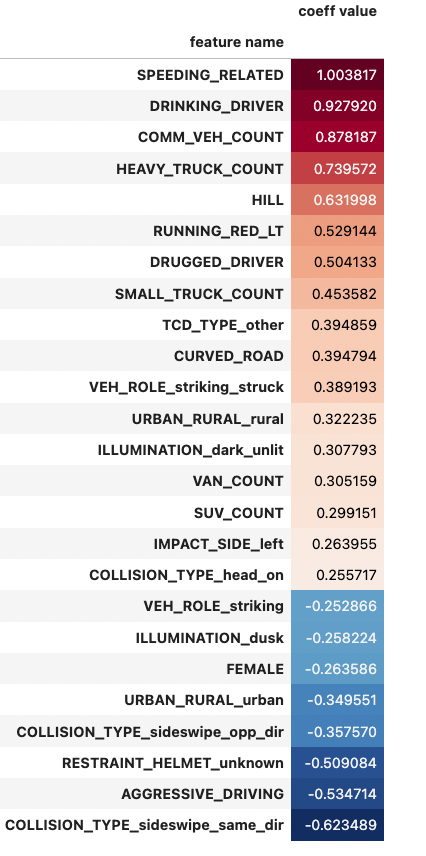
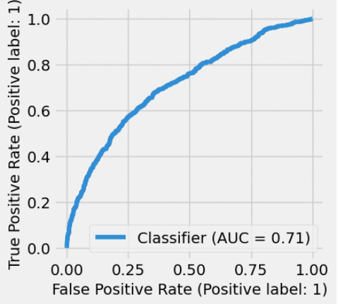
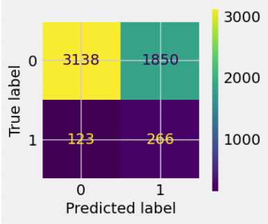
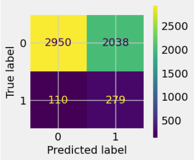

# PA bicycle crashes analysis, 2002-2021
 
## Introduction:
In this project we'll analyze data related to crashes involving bicycles in the state of Pennsylvania during the years 2002-2021. We focus on a publically accessible dataset of crash records in the state which is made available by Pennsylvania Department of Transportation (PENNDOT).

The central goal is to examine the prevalence of various aspects of vehicle crashes involving bicycles in Pennsylvania, analyze how these factors might affect the severity of the crash from the cyclist's point of view, and build and evaluate machine learning models to predict serious cyclist injury or cyclist fatality.

The PENNDOT dataset, as well as related resources such as a data dictionary, can be found (https://pennshare.maps.arcgis.com/apps/webappviewer/index.html?id=8fdbf046e36e41649bbfd9d7dd7c7e7e).

## Repository contents:

The project repository consists of the following components:
1. Two IPython files in the main directory:
    * 1_PA_bike_crashes_data.ipynb : A notebook which demonstrates the acquisition and cleaning of the dataset
    * 2_PA_bike_crashes_vis.ipynb : A notebook in which the data is analyzed and visualized in order to uncover patterns and inspire actions which might outcomes for cyclists
    * 3_PA_bike_crashes_models.ipynb : A notebook in which machine learning models are developed and evaluated.  These models are classifiers designed to predict whether or not a cyclists suffered serious injury or death.
2. 'data' folder with the following subfolders:
    * 'raw_csv' : a directory containing four .CSV files which are processed in the first notebook
        * 'bicycles_raw.csv' : samples correspond to bicycle vehicles involved in crash events
        * 'crashes_raw.csv' : samples correspond to crash events
        * 'persons_raw.csv' : samples correspond to individuals riding bicycles involved in crash events
        * 'roadway_raw.csv' : samples correspond to roadways related to crash events
     * 'zip' : a directory intended to hold .ZIP files, if you choose to download them from the original PENNDOT page
3. Two data files in main directory, which are the output from '1_PA_bike_crashes_data.ipynb':
    * 'cyclists.csv' : samples correspond to individuals riding bicycles involved in crash events
    * 'crashes.csv' : samples correspond to crash events
4. Several image files used in this readme file
    
## Summary of data analysis results:

1. The annual counts of crashes involving cyclists in PA showed a consistent downward trend since 2004, decreasing from above 1600 incidents to below 800 incidents in 2021.  However, the annual counts or crashes involving serious cyclist injury or fatality have not declined significantly.  In fact, in 2021 there were 103 crashes involving serious cyclist injury and 24 involving cyclist death - both the highest annual counts in this 20-year dataset!
2. Regarding the distributions of certain crash features and their relationship with cyclist injury severity:
    * The majority of cyclists in collisions are between 10-30 years of age.  However, older cyclists are overrepresented among cyclists suffering serious injury or fatality.
    * Around 75% of cyclists in collisions are traveling in a 25mph or below zone, presumably due to the prevalence of low speed limits in urban settings.  However, almost half of cyclists suffering serious injury or fatality were traveling in higher speed limit zones.
    * Midblock collisions were overrepresented among cyclists who suffered serious injury or fatality, possibly due to the higher vehicle speeds seen at midblock - 46% of cyclists suffering serious injury or fatality were in midblock collisions, as opposed to 35% of all cyclists.
    * 7.4% of cyclists involved in crashes suffered serious injury or fatality.  There are certain crash factors such that when we restrict to only crashes in which those factors are present, the percentage of cyclists with serious injury or fatality more than doubles (corresponding percentages in parentheses):
        * Involvement of at least one drugged driver (35.4%) or drinking driver (26.7%) 
        * Involvement of at least one heavy truck (22.4%) or commercial vehicle (17.5%)
        * The crash being speeding-related (21.3%)
        * The crash occuring in a dark unlit setting (20.9%) or at dawn (20%)
        * The crash occuring on a curved roadway (16.3%)
        * The crash occuring in a rural setting (15.9%)
    * When we restrict to crashes involving some pairs of two of these factors, the percentage of cyclists suffering serious injury or fatality surpassed 40%:
        * Speeding-related crashes with a drinking driver involved (51.43%)
        * Speeding-related crashes in dark unlit conditions (50%)
        * Speeding-related crashes on a curved roadway (44.4%)
        * Crashes involving a drinking driver on a curved roadway (42.9%)
        * Crashes on a curved roadway in dark unlit conditions (42.5%)
        
## Summary of machine learning model process and results

We developed two types of classifier models in order to predict whether a cyclist suffered serious injury or fatality: logistic regression and gradient boosted decision tree models.  Models were evaluated on the ROC-AUC score, and then 

### Feature selection

We identified features in two ways:
* Based on their log-odds coefficient values in a fitted LogistricRegression model (with purely L1 regularization, to promote sparsity of the coefficients)
* Based on their impurity-based feature importance values in a fitted GradientBoostingClassifier model

<figure>
    
    <figcaption align = "center">The most impactful features for the two baseline models.</figcaption>
</figure>

The first chart lists all features whose log-odds coefficient is greater than 0.25 in magnitude.  The second chart lists all features whose feature importance is greater than 0.1.  There is significant overlap in these two lists of impactful features, and they confirm many of the suspicions raised in Part II of this project.

In our final models, we used the set of features which had nonzero coefficients in the L1-regularized logistic regression model.

### Hyperparameter tuning

After tuning hyperparameters to optimize ROC-AUC score via randomized search five-fold cross validation, our chosen models of each type were:
* A LogisticRegression model with Elastic-Net regularization - roughly equal balance of L1 and L2 regularization - and C-value roughly equal to 0.115.
* A HistGradientBoostingClassifer model (for its computational speed) with learning rate = 0.142, max tree depth of 2, minimum samples per leaf of 140, and L2 regularization parameter around 2.4; all other hyperparameters were left at defualt values.  We set the number of iterations to be very large, and used early stopping to end our training.

The ROC-AUC score is computed based on the model's predicted probabilities, and so this process doesn't result in an optimum choice for the prediction threshold.  We selected prediction thresholds for both models which optiized the $F_3$ score, a variant of the classical $F_1$ score which considers recall of the positive class (serious cyclist injury or cyclist fatality) as three times as important as important as recall of the negative class.

### Performance on the holdout test set

<figure>

    <figcaption align="center">The ROC curve and confusion matrix for our selected linear regression model.</figcaption>
</figure>    

<figure>

    <figcaption align="center">The ROC curve and confusion matrix for our selected gradient boostied decision tree model.</figcaption>
</figure>
    
When trained on the entire training set and scored on the holdout test set, both models had ROC-AUC scores in the low 70's - which generally qualifies them as 'adequate' classifiers.  Using the classification threshold values we selected in the parameter tuning phase, the linear regression model had 68% recall on the cyclists who suffered serious injury or fatality and 63% recall on those who didn't.  The gradient boosted decision tree model had 72% recall on the cyclists suffering serious injury or fatality, and 59% recall on the others.

## Recommendations 
    
Based on my findings, I would recommend the following actions to be taken in an effort to reduce the incidence of serious cyclist injury and cyclist fatality (as well as cyclist crashes in general) in Pennsylvania:

1. Bolstering cyclist education efforts regarding:
    * Safer riding practices around heavy trucks
    * Choosing routes with lower posted speed limits when possible
    * Visibility measures for low light riding conditions - reflectors, reflective clothing, headlights, taillights
    
2. Bolstering education efforts for private motorists and commercial vehicle drivers involving:
    * The serious risks involved with impaired driving and speeding
    * Awareness of cyclists and driving practices that help keep cyclists safe, especially when:
        * Driving in low light conditions
        * Driving in areas with higher posted speed limits
        * Driving during high-traffic times,e.g. morning and evening weekday commuting hours
        * Navigating curved roadways
3. Infrastructure improvements
    * Upgrading and/or repairing roadway lighting in areas where cyclists frequent, especially along curves and with attention to midblock areas.
    * Adding protected bicycle lanes/routes along roads commonly used by bicyclists, with a focus on:
        * routes with higher posted speed limits and/or where motor vehicle speeding is very prevalent
        * routes with significant use by heavy trucks and/or commercial vehicles
        * routes that are used heavily during the weekday morning and evening commutues
