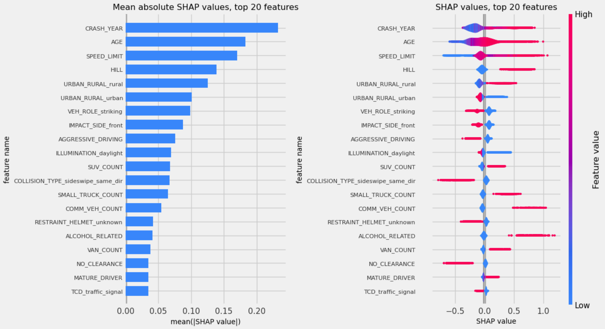

# BikeSaferPA: predicting outcomes for cyclists using Pennsylvania crash data, 2002-2021

**Visit [NBViewer](https://nbviewer.org/github/e-tweedy/BikeSaferPA/tree/main/) for better rendering of project notebooks!**
## Introduction to the BikeSaferPA project

Which factors most dramatically impact a cyclist's risk of suffering serious injury or death in a crash?

Can we predict the severity of a cyclist's outcome based on these factors?

To address these questions I've build **BikeSaferPA**, a machine learning model which I designed to predict whether a cyclist in a crash in Pennsylvania will suffer serious injury or fatality as a result.  I focused on a publically accessible dataset of crash records in the state during the period of 2002-2021, made available by Pennsylvania Department of Transportation (PENNDOT).

The central goals of this project were to examine the prevalence of various aspects of vehicle crashes involving bicycles in Pennsylvania, analyze how these factors might affect the severity of the crash from the cyclist's point of view, and build the BikeSafePA model to both make predictions and better understand the influence of these factors.

The PENNDOT dataset, as well as related resources such as a data dictionary, can be found (https://pennshare.maps.arcgis.com/apps/webappviewer/index.html?id=8fdbf046e36e41649bbfd9d7dd7c7e7e).

## Repository contents:

The project repository consists of the following components:
1. Three IPython files in the main directory:
    * '1_BikeSaferPA_data.ipynb' : A notebook which demonstrates the acquisition and cleaning of the dataset.
    * '2_BikeSaferPA_vis.ipynb' : A notebook in which the data is analyzed and visualized in order to uncover patterns and inspire actions which might improve outcomes for cyclists.
    * '3_BikeSaferPA_models.ipynb' : A notebook which demonstrates the development of the BikeSaferPA model.
2. 'data' directory with the following subdirectories:
    * 'raw_csv' : a directory containing four .CSV files which are processed in '1_BikeSaferPA_data.ipynb'
        * 'bicycles_raw.csv' : samples correspond to bicycle vehicles involved in crash events
        * 'crashes_raw.csv' : samples correspond to crash events
        * 'persons_raw.csv' : samples correspond to individuals riding bicycles involved in crash events
        * 'roadway_raw.csv' : samples correspond to roadways related to crash events
     * 'zip' : a directory intended to hold .ZIP files, if you choose to download them from the original PENNDOT page
3. 'lib' directory containing Python modules:
	* 'get_data.py' : contains functions for data extraction used in '1_BikeSaferPA_data.ipynb'
	* 'vis_data.py' : contains functions for data visualization used in '2_BikeSaferPA_vis.ipynb'
	* 'transform_data.py' : contains functions for data transformation used in '3_BikeSaferPA_models.ipynb'
	* 'study_classif.py' : contains classes used to study classifier pipelines in '3_BikeSaferPA_models.ipynb'
3. Two data files in main directory, which are the output from '1_BikeSaferPA_data.ipynb':
    * 'cyclists.csv' : samples correspond to individuals riding bicycles involved in crash events
    * 'crashes.csv' : samples correspond to crash events
4. Several image files used in this readme file
    
## Summary of data analysis results:

1. The annual counts of crashes involving cyclists in PA showed a consistent downward trend since 2004, decreasing from above 1600 incidents to below 800 incidents in 2021.  However, the annual counts or crashes involving serious cyclist injury or fatality have not declined significantly.  In fact, in 2021 there were 103 crashes involving serious cyclist injury and 24 involving cyclist death - both the highest annual counts in this 20-year dataset!
2. Regarding the distributions of certain crash features and their relationship with cyclist injury severity:
    * The majority of cyclists in collisions are between 10-30 years of age.  However, older cyclists are overrepresented among cyclists suffering serious injury or fatality.
    * Around 75% of cyclists in collisions are traveling in a 25mph or below zone, presumably due to the prevalence of low speed limits in urban settings.  However, almost half of cyclists suffering serious injury or fatality were traveling in higher speed limit zones.
    * Midblock collisions were overrepresented among cyclists who suffered serious injury or fatality, possibly due to the higher vehicle speeds seen at midblock - 46% of cyclists suffering serious injury or fatality were in midblock collisions, as opposed to 35% of all cyclists.
    * 7.4% of cyclists involved in crashes suffered serious injury or fatality.  There are certain crash factors such that when conditioned upon, the percentage of cyclists with serious injury or fatality more than doubles (corresponding percentages in parentheses):
        * Involvement of at least one drugged driver (35.4%) or drinking driver (26.7%) 
        * Involvement of at least one heavy truck (22.4%) or commercial vehicle (17.5%)
        * The crash being speeding-related (21.3%)
        * The crash occuring in a dark unlit setting (20.9%) or at dawn (20%)
        * The crash occuring on a curved roadway (16.3%)
        * The crash occuring in a rural setting (15.9%)
    * When conditioned upon some pairs of these factors, the percentage of cyclists suffering serious injury or fatality surpassed 40%:
        * Speeding-related crashes with a drinking driver involved (51.43%)
        * Speeding-related crashes in dark unlit conditions (50%)
        * Speeding-related crashes on a curved roadway (44.4%)
        * Crashes involving a drinking driver on a curved roadway (42.9%)
        * Crashes on a curved roadway in dark unlit conditions (42.5%)
        
## Summary of BikeSaferPA model development

In my development of BikeSaferPA, I considered two families of classifier models: logistic regression and gradient boosted decision trees.  Models cadidates were evaluated on the ROC-AUC score, and then prediction thresholds were chosen by analyzing $F_{\beta}$ scores.

### Feature selection

I first selected features based on their log-odds coefficient values in a fitted LogisticRegression model (with purely L1 regularization, to promote sparsity of the coefficients).  Specifically, I omitted some features which had zero or very small coefficients, suggesting they're not very important to the model's expressability.  It's crucial here that I applied standard scaling to our numerical features ahead of time - if features are at vastly different scales, then their log-odds coefficients can provide misleading information.
This reduced set of features was used to construct both logistric regression and gradient boosted tree models.

##### Feature encoding

I encoded features in several ways:
* One-hot encoding was applied to categorical features
* Standardizing was applied to numerical features (i.e. rescaled to mean 0 and variance 1)
* After considering several options for the cyclical features DAY_OF_WEEK and HOUR_OF_DAY, I ultimately chose periodic spline encoding based on its performance and efficiency
* Binary features, as well as ordinal features of the form vehictle_COUNT, were left unchanged

This encoding was automated via a model pipeline.

##### Hyperparameter tuning

I examined several logistic regression and gradient boosted decision tree models with a wide variety of hyperparameter settings.  After tuning hyperparameters to optimize ROC-AUC score via randomized search with five-fold cross validation, our two best models were:
* A LogisticRegression model with only L2-regularization and C-value (the inverse of the regularization strength) roughly equal to 0.053.
* A HistGradientBoostingClassifer model (for its computational speed) with learning rate = 0.142, max tree depth of 2, minimum samples per leaf of 140, and L2 regularization parameter around 2.4; all other hyperparameters were left at defualt values.  I set the number of iterations to be very large, and used early stopping to end our training.

The ROC-AUC score is computed based on how the model's predicted probabilities affect the true positive and true negative rates at all possible prediction thresholds, and so optimizing the AUC doesn't on its own provide a choice for the best prediction threshold.  I selected prediction thresholds for both models which optiized the $F_3$ score, a variant of the classical $F_1$ score which considers recall of the positive class (serious cyclist injury or cyclist fatality) as three times as important as important as recall of the negative class.

##### Selecting the BikeSaferPA model

**Based on its performance with respect to ROC-AUC score, I selected the gradient boosted tree algorithm as our BikeSaferPA model!**

<figure>

    <figcaption align="center">The ROC curve and confusion matrix for the BikeSaferPA classifier model.</figcaption>
</figure>
    
When trained on the entire training set and scored on the holdout test set, BikeSaferPA attains ROC-AUC score of around 0.72.  Using the classification threshold values I selected in the parameter tuning phase, the model correctly classifies 68% of cyclists in the test set who suffered serious injury or fatality, and correctly classifies 64% of those who didn't.  I set the threshold to optimize the $F_3$ score, a variant of the $F_1$ score which views recall as three times as important as precision; adjusting it further could produce variants which are better at identifying cyclists at risk of serious injury or death, but they would also accumulate more false positives.  The end-user of BikeSaferPA should adjust its classification threshold to accomodate the needs of their particular use case.

### Interpreting BikeSaferPA based on SHAP values
I computed SHAP (SHapley Additive exPlanation) values on the test set.  SHAP values are very reliable metrics for determining the importance of features to the model's predictions and help to explain the decisions made by models such as BikeSaferPA.

<figure>

    <figcaption align="center">Plots showing SHAP values for various features in the BikeSaferPA model.  Only the 20 features with larges mean absolute SHAP values are shown.</figcaption>
</figure>

*Note: the following statements should not be interpreted as inferring causality; rather, they are statements about how conditioning on certain factors affects the expected prediction of BikeSaferPA!*

Based on SHAP values, I drew several conclusions about BikeSaferPA's predicted probability that a cyclist suffered serious injury or fatality:
* An older cyclists's age pushes it up, and the strength of the push increases with age
* A higher speed limit pushes it up, and the strength of the push increases with speed limit
* The year being recent pushes it up, and that effect has been growing since 2016
* A male cyclist's gender pushes it up
* The following factors push it up strongly:
    * The collision being speeding-related, alcohol-related, or drug-related, or on a hill
    * The presence of a drinking driver, a truck, a SUV, or a commercial vehicle
    * The collision being head-on or rear-end
* The following factors push it up somewhat:
    * The collision being midblock, on a curved road,in a rural setting, or in dark unlit conditions
    * The collision involving a driver running a red light
    * The cyclist is both striking and struck in the collision
* The following factors push it down:
    * The collision is a sideswipe, either same or opposite direction
    * The collision involves an aggressive driving behavior (besides the aforementioned ones that push it up)
    * The cyclist is not wearing a helmet; this effect is possibly driven somewhat by their increased likelihood to be younger and riding in lower speed zones

### Policy recommendations based on BikeSaferPA results

Based on the results of BikeSaferPA's SHAP values, I would recommend the following actions to be taken in an effort to reduce the incidence of serious cyclist injury and cyclist fatality (as well as cyclist crashes in general) in Pennsylvania:

1. Increasing cyclist education efforts regarding:
    * Safer riding practices around trucks and commercial vehicles
    * Choosing routes with lower posted speed limits when possible
    * Visibility measures for low light riding conditions - reflectors, reflective clothing, headlights, taillights
    * The serious risk resulting from dangerous cyclist behavior:
        * Speeding, running stop signs, or running traffic lights
        * Wrong-way riding, as head-on collisions are the most likely type to result in severe injury or death
    
2. Increasing education efforts for private motorists and commercial vehicle drivers involving:
    * The serious risk resulting from several dangerous types of driver behavior:
        * Driving while under the influence of drugs or alcohol
        * Speeding, running stop signs, or running traffic lights
    * Awareness of cyclists and driving practices that help keep cyclists safe, especially when:
        * Driving in low light conditions
        * Driving in areas with higher posted speed limits
        * Driving during high-traffic times,e.g. morning and evening weekday commuting hours
        * Navigating curved roadways and hilly roadways
3. Increasing enforcement of speeding, driving a motor vehicle while impaired, and running red lights and stop signs.
4. Investing in infrastructure improvements:
    * Upgrading and/or repairing roadway lighting in areas where cyclists frequent, especially on midblock stretches and areas of roadway with curves, hills, in rural settings, and areas with higher posted speed limits.
    * Adding protected bicycle lanes/routes along roads commonly used by bicyclists, with a focus on:
        * routes with higher posted speed limits and/or where motor vehicle speeding is very prevalent
        * routes with significant use by heavy trucks and/or commercial vehicles
        * routes that are used heavily during the weekday morning and evening commutes
5. Investing in research to investigate reason(s) for the increasing prevalence of serious injury or fatality among cyclists in collisions during the period of 2002-2021.  If this trend continues, cyclists in PA will be in much more danger in the future!
